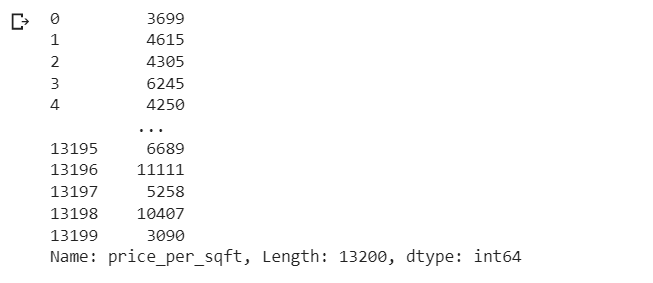

# Ex02-Outlier

You are given bhp.csv which contains property prices in the city of banglore, India. You need to examine price_per_sqft column and do following,

(1) Remove outliers using IQR 

(2) After removing outliers in step 1, you get a new dataframe.

(3) use zscore of 3 to remove outliers. This is quite similar to IQR and you will get exact same result

(4) for the data set height_weight.csv find the following

    (i) Using IQR detect weight outliers and print them

    (ii) Using IQR, detect height outliers and print them 

## AIM:
TO detect and remove the outliers in the given data set and save the final data.

## Algorithm:
## Step 1
Import the required packages(pandas,numpy,scipy)

## Step 2
Read the given csv file use read_csv()

## Step 3
Convert the file into a dataframe and get information of the data.

## Step 4
Remove the non numerical data columns using drop() method.

## Step 5
Detect the outliers in the data set using z scores method.

## Step 6
Remove the outliers by z scores and list manupilation or by using Interquartile Range(IQR)

## Step 7
Check if the outliersare removed from data set using graphical methods.

## Step 8
Save the final data set into the file.

# Program:
### (i)For the data set height_weight.csv detect weight outliers using IQR method
```python
import pandas as pd
import numpy as np
import seaborn as sns
from scipy import stats
df=pd.read_csv("/content/height_weight.csv")
df
sns.boxplot(x="weight",data=df)
q1 = df["weight"].quantile(0.25)
q3 = df['weight'].quantile(0.75)
print("First Quantile = ",q1,"\nSecond Quantile = ",q3)
IQR = q3-q1
low = q1-1.5*IQR
high = q3+1.5*IQR
df4 =df[((df['weight']>=low)&(df['weight']<=high))]
df4
sns.boxplot(x="weight",data=df4)
```
### (ii) For the data set height_weight.csv detect height outliers using IQR method.
```python 
sns.boxplot(x="height",data=df)
q1 = df["height"].quantile(0.25)
q3 = df['height'].quantile(0.75)
print("First Quantile = ",q1,"\nSecond Quantile = ",q3)
IQR = q3-q1
low = q1-1.5*IQR
high = q3+1.5*IQR
df4 =df[((df['height']>=low)&(df['height']<=high))]
df4
sns.boxplot(x="height",data=df4)
sns.scatterplot(data=df4)
sns.boxplot(data=df4)
```
## Examine Height column and use IQR to remove outliers and create new dataframe
```python
import pandas as pd
import seaborn as sns
df=pd.read_csv("/content/heights.csv")
df
sns.boxplot(data=df)
median=df.quantile(0.50)
q1=df.quantile(0.25)
q3=df.quantile(0.75)
iqr=q3-q1
q1
df1=df[((df>=q1-1.5*iqr)&(df<=q3+1.5*iqr))]
df1
sns.boxplot(data=df1)
```
## Examine price_per_sqft column and use IQR to remove outliers and create new dataframe
```python
import pandas as pd
import seaborn as sns
df=pd.read_csv("/content/bhp.csv")
df
d2=df['price_per_sqft']
d2
sns.boxplot(data=df)
sns.boxplot(data=df['price_per_sqft'])
q1 = df["price_per_sqft"].quantile(0.25)
q3 = df['price_per_sqft'].quantile(0.75)
print("First Quantile = ",q1,"\nSecond Quantile = ",q3)
IQR = q3-q1
low = q1-1.5*IQR
high = q3+1.5*IQR
df2 =df[((df['price_per_sqft']>=low)&(df['price_per_sqft']<=high))]
df2
sns.boxplot(data=df2['price_per_sqft'])
```
## Examine price_per_sqft column and use zscore of 3 to remove outliers.
```python
from scipy import stats
import numpy as np
z = np.abs(stats.zscore(df['price_per_sqft']))
df2 = df[(z<3)]
df2
df2.shape
sns.boxplot(y="price_per_sqft",data=df2)
```
# Output
### DATASET FOR WEIGHT_HEIGHT_CSV

### DATASET BOXPLOT WITH OUTLIERS(WEIGHT_HEIGHT)


###  DATASET BOXPLOT WITHOUT OUTLIERS(WEIGHT_HEIGHT)


### DATASET FOR HEIGHT_CSV

### DATASET BOXPLOT WITH OUTLIERS

###  DATASET BOXPLOT WITHOUT OUTLIERS

### DATASET FOR bhp.csv


### bhp Boxplot

### price_per_sqft BoxPlot

### WITHOUT OUTLIERS IN DATABASE

### DATASET BOXPLOT AFTER REMOVAL OF OUTLIERS USING Z-SCORE(BHP)

